# 📊 Modelagem de Dados - Schema Inicial Heloilo

## Visão Geral

Este documento apresenta a modelagem completa do banco de dados para o sistema Heloilo, incluindo todas as entidades identificadas nos requisitos funcionais, seus atributos com tipos de dados, relacionamentos, cardinalidades e constraints.

## Diagrama ER (Entity-Relationship)

```mermaid
erDiagram
    USER {
        BIGINT id PK
        STRING email UK
        STRING password_hash
        STRING name
        STRING nickname
        STRING profile_photo_url
        STRING theme_color
        BOOLEAN is_active
        TIMESTAMP created_at
        TIMESTAMP updated_at
        TIMESTAMP deleted_at
    }

    RELATIONSHIP {
        BIGINT id PK
        BIGINT user1_id FK
        BIGINT user2_id FK
        DATE met_date
        STRING met_location
        DATE relationship_start_date
        ENUM celebration_type
        BOOLEAN is_active
        TIMESTAMP created_at
        TIMESTAMP updated_at
        TIMESTAMP deleted_at
    }

    RELATIONSHIP_INVITATION {
        BIGINT id PK
        BIGINT sender_id FK
        BIGINT receiver_id FK
        ENUM status
        TIMESTAMP sent_at
        TIMESTAMP responded_at
        TIMESTAMP created_at
        TIMESTAMP updated_at
    }

    INITIAL_SETUP {
        BIGINT id PK
        BIGINT relationship_id FK
        BIGINT user_id FK
        BOOLEAN is_completed
        BOOLEAN is_skipped
        TIMESTAMP completed_at
        TIMESTAMP created_at
        TIMESTAMP updated_at
    }

    WISH_CATEGORY {
        BIGINT id PK
        STRING name UK
        STRING emoji
        STRING description
        BOOLEAN is_active
        TIMESTAMP created_at
        TIMESTAMP updated_at
    }

    WISH {
        BIGINT id PK
        BIGINT user_id FK
        BIGINT relationship_id FK
        BIGINT category_id FK
        STRING title
        TEXT description
        STRING link_url
        STRING image_url
        INTEGER importance_level
        TIMESTAMP created_at
        TIMESTAMP updated_at
        TIMESTAMP deleted_at
    }

    WISH_COMMENT {
        BIGINT id PK
        BIGINT wish_id FK
        BIGINT user_id FK
        TEXT content
        TIMESTAMP created_at
        TIMESTAMP updated_at
        TIMESTAMP deleted_at
    }

    MEMORY {
        BIGINT id PK
        BIGINT relationship_id FK
        STRING title
        TEXT description
        DATE memory_date
        TIMESTAMP created_at
        TIMESTAMP updated_at
        TIMESTAMP deleted_at
    }

    MEMORY_MEDIA {
        BIGINT id PK
        BIGINT memory_id FK
        STRING file_url
        STRING file_type
        BIGINT file_size
        STRING mime_type
        TIMESTAMP created_at
        TIMESTAMP updated_at
    }

    MEMORY_TAG {
        BIGINT id PK
        BIGINT memory_id FK
        STRING tag_name
        TIMESTAMP created_at
    }

    MOOD_TYPE {
        BIGINT id PK
        STRING name UK
        STRING emoji
        ENUM mood_category
        STRING description
        BOOLEAN is_active
        TIMESTAMP created_at
        TIMESTAMP updated_at
    }

    MOOD_LOG {
        BIGINT id PK
        BIGINT user_id FK
        BIGINT relationship_id FK
        BIGINT mood_type_id FK
        TEXT comment
        DATE log_date
        TIMESTAMP created_at
        TIMESTAMP updated_at
    }

    DAILY_ACTIVITY {
        BIGINT id PK
        BIGINT user_id FK
        STRING title
        TEXT description
        BOOLEAN is_completed
        INTEGER reminder_minutes
        DATE activity_date
        TIMESTAMP created_at
        TIMESTAMP updated_at
        TIMESTAMP deleted_at
    }

    USER_STATUS {
        BIGINT id PK
        BIGINT user_id FK
        STRING current_status
        TIMESTAMP status_updated_at
        TIMESTAMP created_at
        TIMESTAMP updated_at
    }

    CHAT_MESSAGE {
        BIGINT id PK
        BIGINT relationship_id FK
        BIGINT sender_id FK
        TEXT content
        ENUM message_type
        ENUM delivery_status
        TIMESTAMP sent_at
        TIMESTAMP delivered_at
        TIMESTAMP read_at
        TIMESTAMP created_at
        TIMESTAMP updated_at
        TIMESTAMP deleted_at
    }

    MESSAGE_MEDIA {
        BIGINT id PK
        BIGINT chat_message_id FK
        STRING file_url
        STRING file_type
        BIGINT file_size
        STRING mime_type
        TIMESTAMP created_at
        TIMESTAMP updated_at
    }

    NOTIFICATION {
        BIGINT id PK
        BIGINT user_id FK
        BIGINT relationship_id FK
        STRING title
        TEXT content
        ENUM notification_type
        BOOLEAN is_read
        TIMESTAMP sent_at
        TIMESTAMP read_at
        TIMESTAMP created_at
        TIMESTAMP updated_at
    }

    NOTIFICATION_PREFERENCE {
        BIGINT id PK
        BIGINT user_id FK
        ENUM notification_type
        BOOLEAN is_enabled
        TIME quiet_start_time
        TIME quiet_end_time
        ENUM intensity_level
        TIMESTAMP created_at
        TIMESTAMP updated_at
    }

    STORY_PAGE {
        BIGINT id PK
        BIGINT relationship_id FK
        INTEGER page_number
        STRING title
        TEXT content
        STRING image_url
        DATE page_date
        TIMESTAMP created_at
        TIMESTAMP updated_at
        TIMESTAMP deleted_at
    }

    %% Relacionamentos
    USER ||--o{ RELATIONSHIP : "user1"
    USER ||--o{ RELATIONSHIP : "user2"
    USER ||--o{ RELATIONSHIP_INVITATION : "sender"
    USER ||--o{ RELATIONSHIP_INVITATION : "receiver"
    RELATIONSHIP ||--o{ INITIAL_SETUP : "has"
    USER ||--o{ INITIAL_SETUP : "completes"
    
    USER ||--o{ WISH : "creates"
    RELATIONSHIP ||--o{ WISH : "belongs_to"
    WISH_CATEGORY ||--o{ WISH : "categorizes"
    WISH ||--o{ WISH_COMMENT : "has"
    USER ||--o{ WISH_COMMENT : "writes"
    
    RELATIONSHIP ||--o{ MEMORY : "has"
    MEMORY ||--o{ MEMORY_MEDIA : "contains"
    MEMORY ||--o{ MEMORY_TAG : "tagged_with"
    
    USER ||--o{ MOOD_LOG : "logs"
    RELATIONSHIP ||--o{ MOOD_LOG : "belongs_to"
    MOOD_TYPE ||--o{ MOOD_LOG : "defines"
    
    USER ||--o{ DAILY_ACTIVITY : "creates"
    USER ||--o{ USER_STATUS : "has"
    
    RELATIONSHIP ||--o{ CHAT_MESSAGE : "has"
    USER ||--o{ CHAT_MESSAGE : "sends"
    CHAT_MESSAGE ||--o{ MESSAGE_MEDIA : "contains"
    
    USER ||--o{ NOTIFICATION : "receives"
    RELATIONSHIP ||--o{ NOTIFICATION : "generates"
    USER ||--o{ NOTIFICATION_PREFERENCE : "configures"
    
    RELATIONSHIP ||--o{ STORY_PAGE : "has"
```



## Especificação das Entidades

### 1. USER (Usuário Individual)

**Descrição**: Representa um usuário individual do sistema, que pode fazer parte de um relacionamento.

| Atributo | Tipo | Nullable | Unique | Default | Descrição |
|----------|------|----------|--------|---------|-----------|
| id | BIGINT | NO | YES | AUTO_INCREMENT | Chave primária |
| email | STRING(255) | NO | YES | - | Email único do usuário |
| password_hash | STRING(255) | NO | NO | - | Hash da senha (bcrypt/Argon2) |
| name | STRING(100) | NO | NO | - | Nome completo |
| nickname | STRING(50) | YES | NO | - | Apelido carinhoso |
| profile_photo_url | STRING(500) | YES | NO | - | URL da foto de perfil |
| theme_color | STRING(7) | YES | NO | '#FF6B9D' | Cor do tema (hex) |
| is_active | BOOLEAN | NO | NO | TRUE | Status ativo/inativo |
| created_at | TIMESTAMP | NO | NO | NOW() | Data de criação |
| updated_at | TIMESTAMP | NO | NO | NOW() | Data de atualização |
| deleted_at | TIMESTAMP | YES | NO | NULL | Soft delete |

**Constraints**:
- Email deve ser válido e único
- Senha deve ter hash seguro
- Cor deve ser formato hex válido

**Índices**:
- PRIMARY KEY (id)
- UNIQUE INDEX (email)
- INDEX (is_active, deleted_at)

### 2. RELATIONSHIP (Relacionamento do Casal)

**Descrição**: Representa o relacionamento entre dois usuários (casal).

| Atributo | Tipo | Nullable | Unique | Default | Descrição |
|----------|------|----------|--------|---------|-----------|
| id | BIGINT | NO | YES | AUTO_INCREMENT | Chave primária |
| user1_id | BIGINT | NO | NO | - | ID do primeiro usuário |
| user2_id | BIGINT | NO | NO | - | ID do segundo usuário |
| met_date | DATE | YES | NO | - | Data em que se conheceram |
| met_location | STRING(255) | YES | NO | - | Local onde se conheceram |
| relationship_start_date | DATE | YES | NO | - | Data de início do relacionamento |
| celebration_type | ENUM | YES | NO | 'ANNUAL' | Tipo de comemoração |
| is_active | BOOLEAN | NO | NO | TRUE | Relacionamento ativo |
| created_at | TIMESTAMP | NO | NO | NOW() | Data de criação |
| updated_at | TIMESTAMP | NO | NO | NOW() | Data de atualização |
| deleted_at | TIMESTAMP | YES | NO | NULL | Soft delete |

**Constraints**:
- user1_id ≠ user2_id
- Datas não podem ser futuras
- Data de início não pode ser anterior a 1900
- celebration_type: 'ANNUAL', 'MONTHLY'

**Índices**:
- PRIMARY KEY (id)
- UNIQUE INDEX (user1_id, user2_id) WHERE is_active = TRUE
- INDEX (is_active, deleted_at)
- INDEX (relationship_start_date)

### 3. RELATIONSHIP_INVITATION (Solicitação de Vinculação)

**Descrição**: Gerencia as solicitações de vinculação entre usuários.

| Atributo | Tipo | Nullable | Unique | Default | Descrição |
|----------|------|----------|--------|---------|-----------|
| id | BIGINT | NO | YES | AUTO_INCREMENT | Chave primária |
| sender_id | BIGINT | NO | NO | - | ID do usuário que enviou |
| receiver_id | BIGINT | NO | NO | - | ID do usuário que recebeu |
| status | ENUM | NO | NO | 'PENDING' | Status da solicitação |
| sent_at | TIMESTAMP | NO | NO | NOW() | Data de envio |
| responded_at | TIMESTAMP | YES | NO | - | Data de resposta |
| created_at | TIMESTAMP | NO | NO | NOW() | Data de criação |
| updated_at | TIMESTAMP | NO | NO | NOW() | Data de atualização |

**Constraints**:
- sender_id ≠ receiver_id
- status: 'PENDING', 'ACCEPTED', 'REJECTED', 'EXPIRED'
- responded_at só pode ser preenchido se status ≠ 'PENDING'

**Índices**:
- PRIMARY KEY (id)
- INDEX (receiver_id, status)
- INDEX (sender_id, status)

### 4. INITIAL_SETUP (Configuração Inicial)

**Descrição**: Controla o processo de configuração inicial do relacionamento.

| Atributo | Tipo | Nullable | Unique | Default | Descrição |
|----------|------|----------|--------|---------|-----------|
| id | BIGINT | NO | YES | AUTO_INCREMENT | Chave primária |
| relationship_id | BIGINT | NO | NO | - | ID do relacionamento |
| user_id | BIGINT | NO | NO | - | ID do usuário |
| is_completed | BOOLEAN | NO | NO | FALSE | Se completou a configuração |
| is_skipped | BOOLEAN | NO | NO | FALSE | Se pulou a configuração |
| completed_at | TIMESTAMP | YES | NO | - | Data de conclusão |
| created_at | TIMESTAMP | NO | NO | NOW() | Data de criação |
| updated_at | TIMESTAMP | NO | NO | NOW() | Data de atualização |

**Constraints**:
- is_completed e is_skipped não podem ser ambos TRUE
- completed_at só pode ser preenchido se is_completed = TRUE

**Índices**:
- PRIMARY KEY (id)
- UNIQUE INDEX (relationship_id, user_id)
- INDEX (relationship_id, is_completed, is_skipped)

### 5. WISH_CATEGORY (Categoria de Desejos)

**Descrição**: Categorias predefinidas para organizar desejos.

| Atributo | Tipo | Nullable | Unique | Default | Descrição |
|----------|------|----------|--------|---------|-----------|
| id | BIGINT | NO | YES | AUTO_INCREMENT | Chave primária |
| name | STRING(50) | NO | YES | - | Nome da categoria |
| emoji | STRING(10) | NO | NO | - | Emoji representativo |
| description | STRING(255) | YES | NO | - | Descrição da categoria |
| is_active | BOOLEAN | NO | NO | TRUE | Categoria ativa |
| created_at | TIMESTAMP | NO | NO | NOW() | Data de criação |
| updated_at | TIMESTAMP | NO | NO | NOW() | Data de atualização |

**Constraints**:
- Nome deve ser único
- Emoji deve ser válido

**Índices**:
- PRIMARY KEY (id)
- UNIQUE INDEX (name)
- INDEX (is_active)

### 6. WISH (Desejo/Lista de Desejos)

**Descrição**: Representa um desejo criado por um usuário.

| Atributo | Tipo | Nullable | Unique | Default | Descrição |
|----------|------|----------|--------|---------|-----------|
| id | BIGINT | NO | YES | AUTO_INCREMENT | Chave primária |
| user_id | BIGINT | NO | NO | - | ID do usuário criador |
| relationship_id | BIGINT | NO | NO | - | ID do relacionamento |
| category_id | BIGINT | YES | NO | - | ID da categoria |
| title | STRING(500) | NO | NO | - | Título do desejo |
| description | TEXT | YES | NO | - | Descrição detalhada |
| link_url | STRING(1000) | YES | NO | - | Link externo |
| image_url | STRING(500) | YES | NO | - | URL da imagem |
| importance_level | INTEGER | NO | NO | 3 | Nível de importância (1-5) |
| created_at | TIMESTAMP | NO | NO | NOW() | Data de criação |
| updated_at | TIMESTAMP | NO | NO | NOW() | Data de atualização |
| deleted_at | TIMESTAMP | YES | NO | NULL | Soft delete |

**Constraints**:
- importance_level entre 1 e 5
- link_url deve ser HTTP/HTTPS válido
- Título máximo 500 caracteres
- Descrição máximo 2000 caracteres

**Índices**:
- PRIMARY KEY (id)
- INDEX (relationship_id, deleted_at)
- INDEX (user_id, created_at)
- INDEX (category_id)
- INDEX (importance_level)

### 7. WISH_COMMENT (Comentários em Desejos)

**Descrição**: Comentários e notas em desejos.

| Atributo | Tipo | Nullable | Unique | Default | Descrição |
|----------|------|----------|--------|---------|-----------|
| id | BIGINT | NO | YES | AUTO_INCREMENT | Chave primária |
| wish_id | BIGINT | NO | NO | - | ID do desejo |
| user_id | BIGINT | NO | NO | - | ID do usuário |
| content | TEXT | NO | NO | - | Conteúdo do comentário |
| created_at | TIMESTAMP | NO | NO | NOW() | Data de criação |
| updated_at | TIMESTAMP | NO | NO | NOW() | Data de atualização |
| deleted_at | TIMESTAMP | YES | NO | NULL | Soft delete |

**Constraints**:
- Conteúdo máximo 2000 caracteres

**Índices**:
- PRIMARY KEY (id)
- INDEX (wish_id, created_at)
- INDEX (user_id, created_at)

### 8. MEMORY (Memória/Momento Especial)

**Descrição**: Representa uma memória ou momento especial do casal.

| Atributo | Tipo | Nullable | Unique | Default | Descrição |
|----------|------|----------|--------|---------|-----------|
| id | BIGINT | NO | YES | AUTO_INCREMENT | Chave primária |
| relationship_id | BIGINT | NO | NO | - | ID do relacionamento |
| title | STRING(255) | NO | NO | - | Título da memória |
| description | TEXT | YES | NO | - | Descrição da memória |
| memory_date | DATE | NO | NO | - | Data da memória |
| created_at | TIMESTAMP | NO | NO | NOW() | Data de criação |
| updated_at | TIMESTAMP | NO | NO | NOW() | Data de atualização |
| deleted_at | TIMESTAMP | YES | NO | NULL | Soft delete |

**Constraints**:
- Título máximo 500 caracteres
- Descrição máximo 2000 caracteres

**Índices**:
- PRIMARY KEY (id)
- INDEX (relationship_id, memory_date)
- INDEX (memory_date)

### 9. MEMORY_MEDIA (Mídias das Memórias)

**Descrição**: Fotos e vídeos associados às memórias.

| Atributo | Tipo | Nullable | Unique | Default | Descrição |
|----------|------|----------|--------|---------|-----------|
| id | BIGINT | NO | YES | AUTO_INCREMENT | Chave primária |
| memory_id | BIGINT | NO | NO | - | ID da memória |
| file_url | STRING(500) | NO | NO | - | URL do arquivo |
| file_type | STRING(20) | NO | NO | - | Tipo do arquivo |
| file_size | BIGINT | NO | NO | - | Tamanho em bytes |
| mime_type | STRING(100) | NO | NO | - | Tipo MIME |
| created_at | TIMESTAMP | NO | NO | NOW() | Data de criação |
| updated_at | TIMESTAMP | NO | NO | NOW() | Data de atualização |

**Constraints**:
- file_type: 'IMAGE', 'VIDEO'
- file_size máximo 50MB para vídeos, 10MB para imagens

**Índices**:
- PRIMARY KEY (id)
- INDEX (memory_id)
- INDEX (file_type)

### 10. MEMORY_TAG (Tags das Memórias)

**Descrição**: Tags para organizar memórias.

| Atributo | Tipo | Nullable | Unique | Default | Descrição |
|----------|------|----------|--------|---------|-----------|
| id | BIGINT | NO | YES | AUTO_INCREMENT | Chave primária |
| memory_id | BIGINT | NO | NO | - | ID da memória |
| tag_name | STRING(50) | NO | NO | - | Nome da tag |
| created_at | TIMESTAMP | NO | NO | NOW() | Data de criação |

**Constraints**:
- tag_name máximo 50 caracteres

**Índices**:
- PRIMARY KEY (id)
- INDEX (memory_id)
- INDEX (tag_name)

### 11. MOOD_TYPE (Tipos de Humor)

**Descrição**: Tipos predefinidos de humor.

| Atributo | Tipo | Nullable | Unique | Default | Descrição |
|----------|------|----------|--------|---------|-----------|
| id | BIGINT | NO | YES | AUTO_INCREMENT | Chave primária |
| name | STRING(50) | NO | YES | - | Nome do humor |
| emoji | STRING(10) | NO | NO | - | Emoji representativo |
| mood_category | ENUM | NO | NO | - | Categoria do humor |
| description | STRING(255) | YES | NO | - | Descrição do humor |
| is_active | BOOLEAN | NO | NO | TRUE | Tipo ativo |
| created_at | TIMESTAMP | NO | NO | NOW() | Data de criação |
| updated_at | TIMESTAMP | NO | NO | NOW() | Data de atualização |

**Constraints**:
- mood_category: 'POSITIVE', 'NEGATIVE', 'NEUTRAL'
- Nome deve ser único

**Índices**:
- PRIMARY KEY (id)
- UNIQUE INDEX (name)
- INDEX (mood_category, is_active)

### 12. MOOD_LOG (Registro de Humor)

**Descrição**: Registro diário do humor dos usuários.

| Atributo | Tipo | Nullable | Unique | Default | Descrição |
|----------|------|----------|--------|---------|-----------|
| id | BIGINT | NO | YES | AUTO_INCREMENT | Chave primária |
| user_id | BIGINT | NO | NO | - | ID do usuário |
| relationship_id | BIGINT | NO | NO | - | ID do relacionamento |
| mood_type_id | BIGINT | NO | NO | - | ID do tipo de humor |
| comment | TEXT | YES | NO | - | Comentário opcional |
| log_date | DATE | NO | NO | - | Data do registro |
| created_at | TIMESTAMP | NO | NO | NOW() | Data de criação |
| updated_at | TIMESTAMP | NO | NO | NOW() | Data de atualização |

**Constraints**:
- Comentário máximo 2000 caracteres
- Pode ter múltiplos registros por dia

**Índices**:
- PRIMARY KEY (id)
- INDEX (user_id, log_date)
- INDEX (relationship_id, log_date)
- INDEX (mood_type_id)

### 13. DAILY_ACTIVITY (Atividades da Agenda)

**Descrição**: Atividades e tarefas da agenda diária.

| Atributo | Tipo | Nullable | Unique | Default | Descrição |
|----------|------|----------|--------|---------|-----------|
| id | BIGINT | NO | YES | AUTO_INCREMENT | Chave primária |
| user_id | BIGINT | NO | NO | - | ID do usuário |
| title | STRING(255) | NO | NO | - | Título da atividade |
| description | TEXT | YES | NO | - | Descrição da atividade |
| is_completed | BOOLEAN | NO | NO | FALSE | Se foi concluída |
| reminder_minutes | INTEGER | YES | NO | - | Lembrete em minutos |
| activity_date | DATE | NO | NO | - | Data da atividade |
| created_at | TIMESTAMP | NO | NO | NOW() | Data de criação |
| updated_at | TIMESTAMP | NO | NO | NOW() | Data de atualização |
| deleted_at | TIMESTAMP | YES | NO | NULL | Soft delete |

**Constraints**:
- Título máximo 500 caracteres
- Descrição máximo 2000 caracteres
- reminder_minutes: 5, 15, 30, 60

**Índices**:
- PRIMARY KEY (id)
- INDEX (user_id, activity_date)
- INDEX (is_completed, activity_date)

### 14. USER_STATUS (Status em Tempo Real)

**Descrição**: Status atual do usuário em tempo real.

| Atributo | Tipo | Nullable | Unique | Default | Descrição |
|----------|------|----------|--------|---------|-----------|
| id | BIGINT | NO | YES | AUTO_INCREMENT | Chave primária |
| user_id | BIGINT | NO | YES | - | ID do usuário |
| current_status | STRING(255) | NO | NO | - | Status atual |
| status_updated_at | TIMESTAMP | NO | NO | NOW() | Última atualização |
| created_at | TIMESTAMP | NO | NO | NOW() | Data de criação |
| updated_at | TIMESTAMP | NO | NO | NOW() | Data de atualização |

**Constraints**:
- Um usuário só pode ter um status ativo
- Status expira após 4 horas sem atualização

**Índices**:
- PRIMARY KEY (id)
- UNIQUE INDEX (user_id)
- INDEX (status_updated_at)

### 15. CHAT_MESSAGE (Mensagens do Chat)

**Descrição**: Mensagens do chat privado entre o casal.

| Atributo | Tipo | Nullable | Unique | Default | Descrição |
|----------|------|----------|--------|---------|-----------|
| id | BIGINT | NO | YES | AUTO_INCREMENT | Chave primária |
| relationship_id | BIGINT | NO | NO | - | ID do relacionamento |
| sender_id | BIGINT | NO | NO | - | ID do remetente |
| content | TEXT | YES | NO | - | Conteúdo da mensagem |
| message_type | ENUM | NO | NO | 'TEXT' | Tipo da mensagem |
| delivery_status | ENUM | NO | NO | 'SENT' | Status de entrega |
| sent_at | TIMESTAMP | NO | NO | NOW() | Data de envio |
| delivered_at | TIMESTAMP | YES | NO | - | Data de entrega |
| read_at | TIMESTAMP | YES | NO | - | Data de leitura |
| created_at | TIMESTAMP | NO | NO | NOW() | Data de criação |
| updated_at | TIMESTAMP | NO | NO | NOW() | Data de atualização |
| deleted_at | TIMESTAMP | YES | NO | NULL | Soft delete |

**Constraints**:
- message_type: 'TEXT', 'IMAGE', 'AUDIO', 'EMOJI', 'STICKER'
- delivery_status: 'SENT', 'DELIVERED', 'READ'
- Conteúdo máximo 5000 caracteres

**Índices**:
- PRIMARY KEY (id)
- INDEX (relationship_id, sent_at)
- INDEX (sender_id, sent_at)
- INDEX (delivery_status)

### 16. MESSAGE_MEDIA (Mídias do Chat)

**Descrição**: Mídias enviadas no chat.

| Atributo | Tipo | Nullable | Unique | Default | Descrição |
|----------|------|----------|--------|---------|-----------|
| id | BIGINT | NO | YES | AUTO_INCREMENT | Chave primária |
| chat_message_id | BIGINT | NO | NO | - | ID da mensagem |
| file_url | STRING(500) | NO | NO | - | URL do arquivo |
| file_type | STRING(20) | NO | NO | - | Tipo do arquivo |
| file_size | BIGINT | NO | NO | - | Tamanho em bytes |
| mime_type | STRING(100) | NO | NO | - | Tipo MIME |
| created_at | TIMESTAMP | NO | NO | NOW() | Data de criação |
| updated_at | TIMESTAMP | NO | NO | NOW() | Data de atualização |

**Constraints**:
- file_type: 'IMAGE', 'AUDIO'
- file_size máximo 20MB para áudio, 10MB para imagem

**Índices**:
- PRIMARY KEY (id)
- INDEX (chat_message_id)
- INDEX (file_type)

### 17. NOTIFICATION (Notificações)

**Descrição**: Notificações do sistema para os usuários.

| Atributo | Tipo | Nullable | Unique | Default | Descrição |
|----------|------|----------|--------|---------|-----------|
| id | BIGINT | NO | YES | AUTO_INCREMENT | Chave primária |
| user_id | BIGINT | NO | NO | - | ID do usuário |
| relationship_id | BIGINT | NO | NO | - | ID do relacionamento |
| title | STRING(255) | NO | NO | - | Título da notificação |
| content | TEXT | NO | NO | - | Conteúdo da notificação |
| notification_type | ENUM | NO | NO | - | Tipo da notificação |
| is_read | BOOLEAN | NO | NO | FALSE | Se foi lida |
| sent_at | TIMESTAMP | NO | NO | NOW() | Data de envio |
| read_at | TIMESTAMP | YES | NO | - | Data de leitura |
| created_at | TIMESTAMP | NO | NO | NOW() | Data de criação |
| updated_at | TIMESTAMP | NO | NO | NOW() | Data de atualização |

**Constraints**:
- notification_type: 'WISH', 'COMMENT', 'ANNIVERSARY', 'CHAT', 'MOOD'
- Título máximo 500 caracteres
- Conteúdo máximo 2000 caracteres

**Índices**:
- PRIMARY KEY (id)
- INDEX (user_id, is_read, sent_at)
- INDEX (relationship_id, notification_type)

### 18. NOTIFICATION_PREFERENCE (Preferências de Notificação)

**Descrição**: Configurações de notificação por usuário.

| Atributo | Tipo | Nullable | Unique | Default | Descrição |
|----------|------|----------|--------|---------|-----------|
| id | BIGINT | NO | YES | AUTO_INCREMENT | Chave primária |
| user_id | BIGINT | NO | NO | - | ID do usuário |
| notification_type | ENUM | NO | NO | - | Tipo da notificação |
| is_enabled | BOOLEAN | NO | NO | TRUE | Se está habilitada |
| quiet_start_time | TIME | YES | NO | - | Início do período silencioso |
| quiet_end_time | TIME | YES | NO | - | Fim do período silencioso |
| intensity_level | ENUM | NO | NO | 'NORMAL' | Nível de intensidade |
| created_at | TIMESTAMP | NO | NO | NOW() | Data de criação |
| updated_at | TIMESTAMP | NO | NO | NOW() | Data de atualização |

**Constraints**:
- notification_type: 'WISH', 'COMMENT', 'ANNIVERSARY', 'CHAT', 'MOOD'
- intensity_level: 'SILENT', 'NORMAL', 'PRIORITY'
- UNIQUE (user_id, notification_type)

**Índices**:
- PRIMARY KEY (id)
- UNIQUE INDEX (user_id, notification_type)

### 19. STORY_PAGE (Páginas da História)

**Descrição**: Páginas da história cronológica do casal.

| Atributo | Tipo | Nullable | Unique | Default | Descrição |
|----------|------|----------|--------|---------|-----------|
| id | BIGINT | NO | YES | AUTO_INCREMENT | Chave primária |
| relationship_id | BIGINT | NO | NO | - | ID do relacionamento |
| page_number | INTEGER | NO | NO | - | Número da página |
| title | STRING(255) | NO | NO | - | Título da página |
| content | TEXT | YES | NO | - | Conteúdo da página |
| image_url | STRING(500) | YES | NO | - | URL da imagem |
| page_date | DATE | NO | NO | - | Data da página |
| created_at | TIMESTAMP | NO | NO | NOW() | Data de criação |
| updated_at | TIMESTAMP | NO | NO | NOW() | Data de atualização |
| deleted_at | TIMESTAMP | YES | NO | NULL | Soft delete |

**Constraints**:
- page_number deve ser único por relacionamento
- Título máximo 500 caracteres
- Conteúdo máximo 5000 caracteres

**Índices**:
- PRIMARY KEY (id)
- UNIQUE INDEX (relationship_id, page_number)
- INDEX (relationship_id, page_date)

## Relacionamentos Detalhados

### Relacionamentos Principais

1. **USER ↔ RELATIONSHIP** (1:N)
   - Um usuário pode ter múltiplos relacionamentos (histórico)
   - Um relacionamento tem exatamente 2 usuários
   - Cardinalidade: 1:N (um usuário) ↔ N:1 (um relacionamento)

2. **RELATIONSHIP ↔ WISH** (1:N)
   - Um relacionamento pode ter múltiplos desejos
   - Um desejo pertence a um relacionamento
   - Cardinalidade: 1:N

3. **USER ↔ WISH** (1:N)
   - Um usuário pode criar múltiplos desejos
   - Um desejo é criado por um usuário
   - Cardinalidade: 1:N

4. **WISH ↔ WISH_COMMENT** (1:N)
   - Um desejo pode ter múltiplos comentários
   - Um comentário pertence a um desejo
   - Cardinalidade: 1:N

5. **RELATIONSHIP ↔ MEMORY** (1:N)
   - Um relacionamento pode ter múltiplas memórias
   - Uma memória pertence a um relacionamento
   - Cardinalidade: 1:N

6. **MEMORY ↔ MEMORY_MEDIA** (1:N)
   - Uma memória pode ter múltiplas mídias
   - Uma mídia pertence a uma memória
   - Cardinalidade: 1:N

7. **USER ↔ MOOD_LOG** (1:N)
   - Um usuário pode ter múltiplos registros de humor
   - Um registro pertence a um usuário
   - Cardinalidade: 1:N

8. **RELATIONSHIP ↔ CHAT_MESSAGE** (1:N)
   - Um relacionamento pode ter múltiplas mensagens
   - Uma mensagem pertence a um relacionamento
   - Cardinalidade: 1:N

9. **USER ↔ CHAT_MESSAGE** (1:N)
   - Um usuário pode enviar múltiplas mensagens
   - Uma mensagem é enviada por um usuário
   - Cardinalidade: 1:N

10. **RELATIONSHIP ↔ STORY_PAGE** (1:N)
    - Um relacionamento pode ter múltiplas páginas da história
    - Uma página pertence a um relacionamento
    - Cardinalidade: 1:N

### Relacionamentos de Lookup

1. **WISH_CATEGORY ↔ WISH** (1:N)
   - Uma categoria pode ter múltiplos desejos
   - Um desejo pode ter uma categoria (opcional)
   - Cardinalidade: 1:N

2. **MOOD_TYPE ↔ MOOD_LOG** (1:N)
   - Um tipo de humor pode ter múltiplos registros
   - Um registro tem um tipo de humor
   - Cardinalidade: 1:N

## Enumerações e Valores Predefinidos

### ENUM celebration_type
- `ANNUAL` - Comemoração anual
- `MONTHLY` - Comemoração mensal

### ENUM invitation_status
- `PENDING` - Pendente
- `ACCEPTED` - Aceita
- `REJECTED` - Rejeitada
- `EXPIRED` - Expirada

### ENUM mood_category
- `POSITIVE` - Humor positivo
- `NEGATIVE` - Humor negativo
- `NEUTRAL` - Humor neutro

### ENUM message_type
- `TEXT` - Mensagem de texto
- `IMAGE` - Imagem
- `AUDIO` - Áudio
- `EMOJI` - Emoji
- `STICKER` - Sticker

### ENUM delivery_status
- `SENT` - Enviada
- `DELIVERED` - Entregue
- `READ` - Lida

### ENUM notification_type
- `WISH` - Novo desejo
- `COMMENT` - Novo comentário
- `ANNIVERSARY` - Aniversário próximo
- `CHAT` - Nova mensagem
- `MOOD` - Mudança de humor

### ENUM intensity_level
- `SILENT` - Silenciosa
- `NORMAL` - Normal
- `PRIORITY` - Prioritária

## Dados Iniciais (Seed Data)

### WISH_CATEGORY (Categorias Predefinidas)

```sql
INSERT INTO wish_category (name, emoji, description) VALUES
('Viagem', '🌍', 'Lugares que o casal quer conhecer juntos'),
('Compras / Presentes', '🎁', 'Coisas que um quer ganhar ou comprar'),
('Experiências', '✨', 'Atividades e momentos a dois'),
('Metas do Casal', '🎯', 'Objetivos compartilhados'),
('Casa e Decoração', '🏡', 'Ideias para o lar'),
('Datas Especiais', '📅', 'Planos para aniversários e comemorações'),
('Auto-cuidado', '🧘‍♀️', 'Coisas individuais que melhoram o bem-estar'),
('Animais de Estimação', '🐾', 'Desejos relacionados a pets'),
('Projetos Criativos', '🎨', 'Sonhos artísticos ou hobbies'),
('Gastronomia', '🍝', 'Lugares para comer e receitas'),
('Sonhos Grandes', '🌠', 'Coisas mais distantes ou inspiracionais'),
('Doações e Impacto', '💗', 'Desejos voltados a ajudar outros');
```

### MOOD_TYPE (Tipos de Humor Predefinidos)

```sql
INSERT INTO mood_type (name, emoji, mood_category, description) VALUES
-- Positivos
('Feliz / Contente', '😊', 'POSITIVE', 'Sensação de leveza ou satisfação'),
('Animado / Motivado', '🚀', 'POSITIVE', 'Energia para fazer coisas'),
('Calmo / Relaxado', '😌', 'POSITIVE', 'Paz interior, sem estresse'),
('Orgulhoso', '😎', 'POSITIVE', 'Quando sente que fez algo legal'),
('Grato / Satisfeito', '🙏', 'POSITIVE', 'Aprecia o que tem'),

-- Negativos
('Triste / Melancólico', '😢', 'NEGATIVE', 'Desânimo ou sofrimento emocional'),
('Irritado / Frustrado', '😠', 'NEGATIVE', 'Raiva ou impaciência'),
('Ansioso / Preocupado', '😰', 'NEGATIVE', 'Sensação de tensão ou medo'),
('Culpado / Arrependido', '😔', 'NEGATIVE', 'Pensamentos sobre erros'),
('Cansado / Desmotivado', '😴', 'NEGATIVE', 'Falta de energia'),

-- Neutros
('Entediado', '😐', 'NEUTRAL', 'Sem estímulo ou interesse'),
('Confuso / Indeciso', '🤔', 'NEUTRAL', 'Não sabe bem o que pensar'),
('Curioso / Intrigado', '🤨', 'NEUTRAL', 'Mente ativa, querendo descobrir');
```

## Considerações sobre Performance e Integridade

### Índices Estratégicos

1. **Índices Compostos para Consultas Frequentes**:
   - `(relationship_id, deleted_at)` - Para filtrar dados ativos do relacionamento
   - `(user_id, created_at)` - Para ordenação cronológica por usuário
   - `(relationship_id, sent_at)` - Para mensagens do chat ordenadas

2. **Índices para Performance**:
   - `(is_active, deleted_at)` - Soft delete queries
   - `(log_date)` - Consultas de humor por data
   - `(memory_date)` - Memórias ordenadas por data

### Constraints de Integridade

1. **Integridade Referencial**:
   - Todas as FKs têm CASCADE DELETE apropriado
   - Soft delete mantém integridade com `deleted_at`

2. **Constraints de Negócio**:
   - Datas não podem ser futuras (exceto agendamentos)
   - Limites de caracteres conforme requisitos
   - Validação de URLs HTTP/HTTPS

3. **Constraints de Unicidade**:
   - Email único por usuário
   - Relacionamento único entre dois usuários ativos
   - Página única por relacionamento

### Otimizações para Requisitos Não-Funcionais

1. **Performance (RNF01-RNF03)**:
   - Índices otimizados para consultas frequentes
   - Paginação com LIMIT/OFFSET
   - Lazy loading para relacionamentos

2. **Segurança (RNF04-RNF08)**:
   - Hash seguro para senhas
   - Criptografia AES-256 para dados sensíveis
   - Tokens JWT com expiração

3. **Confiabilidade (RNF13-RNF15)**:
   - Soft delete para recuperação
   - Campos de auditoria (created_at, updated_at)
   - Backup incremental com retenção

4. **Manutenibilidade (RNF16-RNF19)**:
   - Schema normalizado
   - Separação clara de responsabilidades
   - Modularidade para expansão

## Considerações de Implementação

### Estratégia de Migração

1. **Fase 1**: Entidades principais (USER, RELATIONSHIP)
2. **Fase 2**: Funcionalidades core (WISH, MEMORY, CHAT)
3. **Fase 3**: Funcionalidades avançadas (MOOD, NOTIFICATIONS)
4. **Fase 4**: Otimizações e índices

### Monitoramento

1. **Métricas de Performance**:
   - Tempo de resposta das consultas
   - Uso de índices
   - Crescimento das tabelas

2. **Métricas de Negócio**:
   - Usuários ativos
   - Relacionamentos criados
   - Interações por dia

### Escalabilidade

1. **Particionamento**:
   - Por relationship_id para dados do casal
   - Por data para logs históricos

2. **Arquivamento**:
   - Dados antigos (> 1 ano) para storage frio
   - Backup incremental diário

---

*Este schema foi projetado para atender todos os requisitos funcionais e não-funcionais do sistema Heloilo, garantindo performance, segurança e manutenibilidade.*
